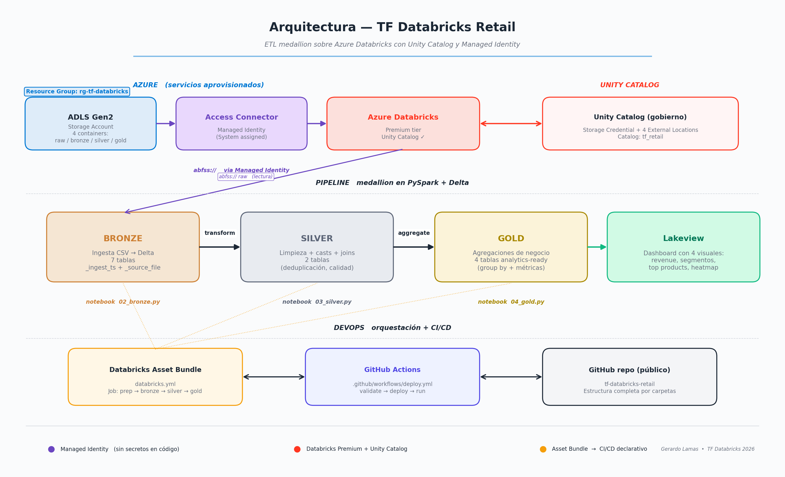

# TF Databricks Retail — ETL Medallion en Azure

Trabajo Final del curso de **Ingeniería de Datos con Databricks**.
Pipeline ETL end-to-end con arquitectura medallion (Bronze → Silver → Gold) sobre Azure Databricks, usando Unity Catalog y Managed Identity para acceso seguro a ADLS Gen2.

---

## Tabla de contenidos

1. [Arquitectura](#arquitectura)
2. [Servicios Azure aprovisionados](#servicios-azure-aprovisionados)
3. [Estructura del repo](#estructura-del-repo)
4. [Datasets utilizados](#datasets-utilizados)
5. [Cómo ejecutar el proyecto](#cómo-ejecutar-el-proyecto)
6. [El ETL en detalle](#el-etl-en-detalle)
7. [Seguridad](#seguridad)
8. [CI/CD con GitHub Actions](#cicd-con-github-actions)
9. [Hallazgos y decisiones de diseño](#hallazgos-y-decisiones-de-diseño)

---

## Arquitectura



### Principios de diseño
- **Sin secretos en código:** la conexión a ADLS es 100% via Managed Identity (no SAS, no account keys, no service principals con secret).
- **Idempotente:** todos los notebooks usan `mode("overwrite")` y `CREATE IF NOT EXISTS`. Se pueden re-ejecutar sin efectos secundarios.
- **Single source of truth:** Unity Catalog gobierna catalog/schema/table + permisos + lineage.
- **Capas independientes:** bronze no sabe de silver, silver no sabe de gold. Falla aislada.

---

## Servicios Azure aprovisionados

| Servicio | Nombre | Tier | Propósito |
|---|---|---|---|
| Resource Group | `rg-tf-databricks` | — | Contenedor de todo (borrar al final = limpieza total) |
| Storage Account ADLS Gen2 | `sttfdatabricks1993` | Standard LRS | Raw + bronze + silver + gold (4 containers) |
| Access Connector for Azure Databricks | `ac-tf-databricks` | — | Identidad gestionada (Managed Identity) |
| Azure Databricks Workspace | `dbw-tf-databricks` | **Premium** | Compute + Unity Catalog + Lakeview |

**Permiso clave:** el Access Connector tiene rol **Storage Blob Data Contributor** sobre el Storage Account. Esa es la única "credencial" del proyecto.

---

## Estructura del repo

```
tf-databricks-retail/
├── PrepAmb/                       # Preparación de ambiente
│   └── 01_prep_ambiente.py        # Crea catalog + schemas
├── proceso/                       # Notebooks del ETL
│   ├── 02_bronze.py               # Ingesta CSV → Delta
│   ├── 03_silver.py               # Limpieza + joins
│   └── 04_gold.py                 # Agregaciones de negocio
├── seguridad/
│   └── 05_grants.sql              # Roles, grupos y GRANTS
├── reversion/
│   └── 06_drop_all.sql            # Limpia tablas/schemas/catalog
├── dashboard/                     # Dashboard Lakeview exportado
│   ├── *.lvdash.json
│   └── *.png
├── datasets/                      # Documentación de datasets (no incluye CSVs)
├── certificaciones/               # Certs personales (opcional)
├── evidencias/                    # Screenshots de ejecución
├── .github/workflows/
│   └── deploy.yml                 # CI/CD GitHub Actions
├── databricks.yml                 # Asset Bundle (define el job)
├── .gitignore
└── README.md                      # Este archivo
```

---

## Datasets utilizados

Dos fuentes de datos reales del mundo retail (mínimo 2 según las consideraciones del trabajo):

1. **E-commerce Sales Prediction** (Kaggle) — 1,000 filas de ventas online con categoría, precio, descuento, segmento de cliente y gasto en marketing.
2. **Instacart Market Basket Analysis** (Kaggle, subido como "Supermarket Superstore Bundle") — 6 archivos relacionales con orders, products, aisles, departments. ~3.2M filas totales.

Ver `datasets/README.md` para links de descarga.

---

## Cómo ejecutar el proyecto

### Pre-requisitos
- Suscripción Azure (free trial es suficiente)
- Cuenta de Kaggle (para descargar datasets)
- GitHub CLI o `git` instalado

### Pasos

1. **Aprovisionar Azure** (manual, ~45 min)
   - Crear Resource Group `rg-tf-databricks` en `East US 2`
   - Crear Storage Account ADLS Gen2 con 4 containers: `raw`, `bronze`, `silver`, `gold`
   - Subir CSVs de Kaggle a `raw/ecommerce/` y `raw/supermarket/`
   - Crear Access Connector for Azure Databricks
   - Asignar al Access Connector el rol **Storage Blob Data Contributor** sobre el storage
   - Crear Azure Databricks Workspace tier **Premium**

2. **Configurar Unity Catalog en Databricks** (manual, ~10 min)
   - Crear Storage Credential `cred-tf-databricks` apuntando al Resource ID del Access Connector
   - Crear 4 External Locations: `extloc_raw`, `extloc_bronze`, `extloc_silver`, `extloc_gold`
   - Validar que pasen el test de conexión

3. **Crear cluster Single Node**
   - Compute → Create compute → Single node, runtime LTS, auto-terminate 20 min, access mode "Single user"

4. **Subir notebooks a Databricks**
   - Importar las carpetas `PrepAmb/` y `proceso/` al workspace
   - O alternativamente, dejar que el Asset Bundle los suba automáticamente vía CI/CD

5. **Ejecutar el ETL en orden**
   - `01_prep_ambiente.py` (crea catalog y schemas)
   - `02_bronze.py` (ingesta los 7 CSVs como tablas Delta)
   - `03_silver.py` (limpia + joins)
   - `04_gold.py` (agregaciones)

6. **Aplicar GRANTS** (opcional, requiere account admin)
   - Ejecutar `seguridad/05_grants.sql` desde SQL Editor

7. **Ver dashboard**
   - Crear o importar el dashboard de `dashboard/Retail_Analytics_TF_Databricks.lvdash.json`

### Para revertir
- Ejecutar `reversion/06_drop_all.sql`
- Borrar el Resource Group entero: `az group delete --name rg-tf-databricks --yes`

---

## El ETL en detalle

### Bronze (capa de ingesta)

Lee CSVs vía Managed Identity (sin claves) y los persiste como Delta. Características:
- **Detección automática de delimitador** (`,` o `;`) — los CSV de Instacart usan punto y coma.
- **Limpieza de nombres de columnas** a snake_case minúscula (Delta no acepta caracteres especiales como espacios o paréntesis).
- **Metadatos de auditoría** por fila: `_ingest_ts` y `_source_file`.
- **Idempotente:** modo overwrite, se puede re-ejecutar sin riesgo.

Output: 7 tablas Delta en `tf_retail.bronze`.

### Silver (capa limpia)

Aplica reglas de calidad de datos:
- Casteo de tipos (date, int, double).
- Drop de filas con nulos en campos clave.
- Filtros de outliers (price > 0, units_sold > 0).
- Deduplicación.
- Para Instacart: **join de las 6 tablas bronze** en un único fact enriquecido `instacart_orders_enriched` con dimensiones (productos, pasillos, departamentos).
- Columnas derivadas: `total_revenue`, `year`, `month`.

Output: 2 tablas Delta en `tf_retail.silver`.

### Gold (capa de negocio)

4 tablas pre-agregadas listas para el dashboard:

| Tabla | Pregunta de negocio |
|---|---|
| `ecom_monthly_by_category` | ¿Qué categorías generan más revenue cada mes? |
| `ecom_segment_by_category` | ¿Qué segmento de cliente gasta más por categoría? |
| `instacart_top_products` | ¿Cuáles son los productos estrella y su tasa de recompra? |
| `instacart_orders_by_dow_hour` | ¿Cuándo (día/hora) compran más los clientes? |

---

## Seguridad

Ver `seguridad/05_grants.sql`.

**Modelo de roles:**

| Grupo | Permisos |
|---|---|
| `tf_retail_consumers` | `USE CATALOG` + `USE SCHEMA` + `SELECT` solo en gold |
| `tf_retail_engineers` | `USE` + `SELECT` + `CREATE TABLE` + `MODIFY` en bronze, silver, gold; `READ FILES` + `WRITE FILES` en external locations |

Esto modela el escenario real donde analistas/BI solo ven lo que ya está agregado y pulido (gold), mientras que ingenieros de datos pueden tocar todas las capas.

---

## CI/CD con GitHub Actions

El workflow `.github/workflows/deploy.yml` ejecuta 3 etapas:

```
push to main / develop
       ↓
   ┌───────────┐
   │ validate  │   →  databricks bundle validate
   └─────┬─────┘
         ↓
   ┌───────────┐
   │  deploy   │   →  databricks bundle deploy --target {dev|prod}
   └─────┬─────┘
         ↓ (solo en main)
   ┌───────────┐
   │    run    │   →  databricks bundle run tf_retail_etl --target prod
   └───────────┘
```

**Setup en GitHub:**
1. Generar PAT en Databricks: User Settings → Developer → Access tokens → Generate.
2. Settings → Secrets and variables → Actions → New repository secret:
   - `DATABRICKS_HOST` = `https://adb-XXXXXXXXX.azuredatabricks.net`
   - `DATABRICKS_TOKEN` = el PAT generado
3. Cualquier push a `main` ejecutará el deploy automático.

---

## Hallazgos y decisiones de diseño

### 1. Datasets de Instacart truncados
Los archivos `orders.csv`, `order_products__prior.csv` y `order_products__train.csv` están truncados a exactamente **1,048,575 filas** cada uno. Ese número es el límite de Excel (`2^20 - 1`), señal de que quien los exportó los abrió en Excel. El ETL los procesa correctamente, pero el lector debe saber que los conteos en silver no representan al dataset original completo de Instacart.

### 2. Inner join filtra ~1.5M filas
La tabla silver `instacart_orders_enriched` tiene 638K filas vs 2.1M en `op_prior + op_train`. Esto es esperado:
- **Deduplicación** por `(order_id, product_id)` quita ~10%.
- **Inner join** con `orders` descarta `order_id` huérfanos (consecuencia del truncamiento del punto 1).

Es un caso real de calidad de datos manejado correctamente.

### 3. Single Node en lugar de cluster con workers
Para datasets de pocos GB, un Single Node es más rápido y barato que un cluster con workers (no hay overhead de shuffle por red). DBU/h: 1.17 vs ~3-4 para un cluster pequeño con 2 workers.

### 4. Catalog con MANAGED LOCATION explícita
El default storage del metastore puede no estar configurado en workspaces nuevos. Apuntar el catalog a una external location concreta evita el error `INVALID_STATE: Metastore storage root URL does not exist`.

### 5. Auto-terminate del cluster a 20 min
Crítico en free trial para no quemar crédito si te olvidas el cluster prendido.

### 6. Lakeview en lugar de Power BI
Decisión de arquitectura: Lakeview viene incluido en el workspace Databricks, no requiere otro servicio Azure ni licencia adicional. Si el requisito hubiera sido Power BI, habría que conectar Azure SQL Database o un Databricks SQL endpoint, sumando complejidad.

---

## Autor

**Gerardo Lamas** — Trabajo Final del curso de Ingeniería de Datos con Databricks.

## Referencias

- [Databricks Medallion Architecture](https://docs.databricks.com/aws/en/lakehouse/medallion)
- [Unity Catalog](https://learn.microsoft.com/en-us/azure/databricks/data-governance/unity-catalog/)
- [Access Connector for Azure Databricks](https://learn.microsoft.com/en-us/azure/databricks/connect/storage/azure-managed-identities)
- [Databricks Asset Bundles](https://docs.databricks.com/dev-tools/bundles/index.html)
